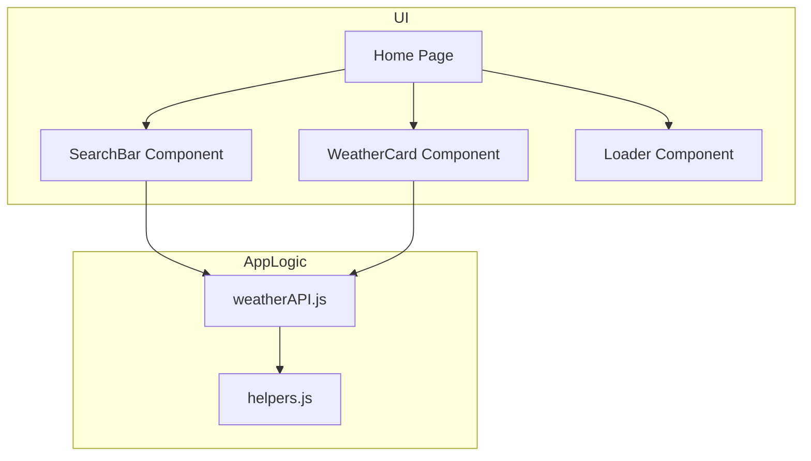
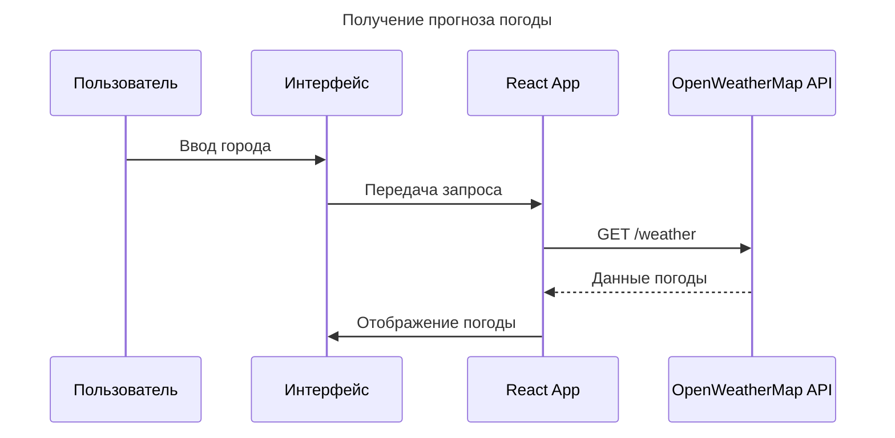

 
# WebWeather — Профессиональная документация проекта

---

## 1. Общая информация

**Название:** WebWeather  
**Автор:** Maivand Rahmani  
**Цель проекта:** Создать современное одностраничное веб-приложение для отображения текущей погоды и прогноза по городам. Проект демонстрирует навыки frontend-разработки, работу с API и построение архитектуры приложения.  
**Тип проекта:** SPA (Single Page Application)  
**Технологии:** React, Vite, SCSS, Axios, React Router DOM, OpenWeatherMap API  

**Краткое описание:**  
WebWeather позволяет пользователю вводить название города, получать текущую погоду и прогноз на несколько дней. Интерфейс адаптивный, с красивой визуализацией температуры, иконками погоды и плавными анимациями.  

---

## 2. Структура проекта

```

WebWeather/
├─ public/
│   ├─ index.html               # Главный HTML файл
│   └─ favicon.ico              # Иконка сайта
├─ src/
│   ├─ App.jsx                  # Основной компонент приложения
│   ├─ main.jsx                 # Точка входа
│   ├─ components/              # Переиспользуемые UI-компоненты
│   │   ├─ WeatherCard.jsx
│   │   ├─ SearchBar.jsx
│   │   └─ Loader.jsx
│   ├─ pages/                   # Страницы приложения
│   │   └─ Home.jsx
│   ├─ api/                     # Работа с API
│   │   └─ weatherAPI.js
│   ├─ styles/                  # SCSS стили
│   │   ├─ main.scss
│   │   └─ variables.scss
│   └─ utils/                   # Утилиты, вспомогательные функции
│       └─ helpers.js
├─ .gitignore
├─ package.json
├─ vite.config.js
└─ README.md

````

> 🔹 Примечание: структура проекта отражает хорошую практику организации кода: компоненты, страницы, стили и API вынесены в отдельные папки.

---

## 3. Используемые технологии и библиотеки

| Технология / библиотека | Назначение |
|-------------------------|------------|
| React                   | Основная библиотека для создания UI |
| Vite                    | Сборка и дев-сервер |
| SCSS / sass-embedded    | Стилизация и управление переменными, миксинами |
| Axios                   | HTTP-запросы к OpenWeatherMap API |
| React Router DOM        | Навигация между страницами (если будет расширение) |
| OpenWeatherMap API      | Источник данных о погоде |
| ESLint / Prettier       | Кодстайл и форматирование |

---

## 4. Установка и запуск

### 4.1 Клонирование репозитория
```bash
git clone https://github.com/Kingnew2006/WebWeather.git
cd WebWeather
````

### 4.2 Установка зависимостей

```bash
npm install
```

### 4.3 Запуск в режиме разработки

```bash
npm run dev
```

После запуска откройте ссылку, указанную в консоли (обычно [http://localhost:5173](http://localhost:5173)).

### 4.4 Сборка для продакшена

```bash
npm run build
```

---

## 5. Диаграмма архитектуры приложения



> 🔹 Описание: Пользователь взаимодействует с компонентами UI → компоненты вызывают API → API использует утилиты → данные возвращаются в UI.

---

## 6. Диаграмма последовательности



---

## 7. Сборка пользовательского опыта

1. Пользователь открывает приложение
2. Вводит название города
3. Компонент SearchBar отправляет запрос к API
4. Полученные данные передаются в компонент WeatherCard
5. Loader отображается пока данные загружаются
6. Данные отображаются на главной странице

---

## 8. Примеры использования

```jsx
// Использование компонента WeatherCard
<WeatherCard
  city="Moscow"
  temperature={5}
  description="Ясно"
  icon="01d"
/>
```

```jsx
// Отправка запроса к API
import { getWeather } from './api/weatherAPI';

async function fetchWeather(city) {
  const data = await getWeather(city);
  console.log(data);
}
```

---

## 9. Лицензия

Проект лицензирован под **GPL-3.0 License**.
Свободно использовать, изменять и распространять с указанием авторства.

---

## 10. Контакты

* **Автор:** Maivand Rahmani
* **Email:** [maivand123r@gmail.com](mailto:maivand.rahmani@example.com)
* **GitHub:** [https://github.com/kingnew2006](https://github.com/kingnew2006)

---
 
 
